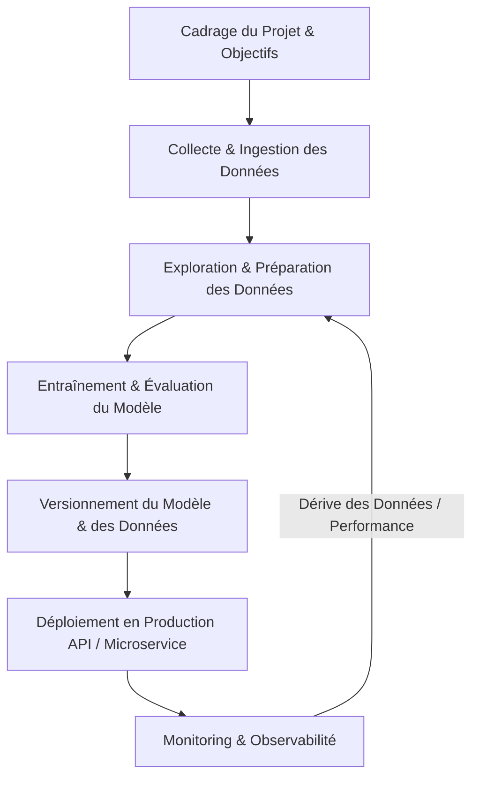

# Architecture & Cycle de Vie du Projet MLOps - House Price Prediction

Ce document décrit l'architecture générale, le cycle de vie et les composants technologiques de la plateforme de prédiction du prix des maisons.

---

## 1. Le Cycle de Vie d'un Projet MLOps

Le MLOps (Machine Learning Operations) combine le Machine Learning, le DevOps et le Data Engineering pour automatiser et fiabiliser la mise en production des modèles de ML. Le cycle de vie d'un tel projet est itératif et se compose de plusieurs étapes interconnectées :

---

## 2. Les Différentes Étapes du Pipeline

### A. Phase d'Ingestion (Data Ingestion)
- **Objectif** : Récupérer les données brutes provenant de diverses sources (bases de données, fichiers plats, APIs externes).
- **Emplacement** : `data/raw/`
- **Action** : Les données brutes ne doivent **jamais** être modifiées directement afin de garantir la reproductibilité.

### B. Phase de Préparation & Nettoyage (Data Processing)
- **Objectif** : Transformer les données brutes en données exploitables.
- **Étapes** :
  1. **Nettoyage** : Traitement des valeurs manquantes, des doublons, et correction des types. (Stockage temporaire dans `data/intermediate/`).
  2. **Feature Engineering** : Encodage des variables catégorielles, normalisation des variables numériques, création de nouvelles variables explicatives.
- **Emplacement final** : `data/processed/`

### C. Phase d'Entraînement et Suivi (Training & Tracking)
- **Objectif** : Entraîner les modèles de régression pour prédire le prix des maisons et suivre leurs métriques de performance.
- **Outil** : **MLflow Tracking** pour sauvegarder les hyperparamètres, la courbe d'apprentissage, et le fichier du modèle.
- **Sélection** : Comparaison automatique des modèles pour sélectionner le meilleur candidat (Champion vs. Challenger).

### D. Phase d'Évaluation & Validation
- **Objectif** : Tester la robustesse du modèle sélectionné sur un jeu de test indépendant et s'assurer qu'il ne souffre pas de surapprentissage (overfitting).
- **Validation** : Vérification des métriques clés ($R^2$, RMSE, MAE).

### E. Phase de Déploiement (Deployment)
- **Objectif** : Rendre le modèle accessible en temps réel sous forme d'API REST.
- **Outil** : **FastAPI** pour l'API web et **Docker** pour conteneuriser l'application et garantir la portabilité.

---

## 3. Les Outils Utilisés et Leurs Rôles

Le projet s'appuie sur une pile technologique moderne et standardisée :

| Outil | Catégorie | Rôle Spécifique dans le Projet |
| :--- | :--- | :--- |
| **Git & GitHub** | Versioning & Collaboration | Gestion de versions du code source, intégration continue (CI/CD) et collaboration d'équipe. |
| **Pandas / Numpy** | Manipulation de données | Nettoyage des données, traitement statistique et ingénierie des features. |
| **Scikit-learn / XGBoost** | Modélisation ML | Entraînement des algorithmes de régression (Random Forest, XGBoost) et évaluation. |
| **MLflow** | MLOps Suite | Suivi des expériences (Tracking), registre des modèles (Model Registry) et reproductibilité. |
| **FastAPI** | Serving | Développement d'une API web performante pour exposer le modèle entraîné. |
| **Docker** | Conteneurisation | Création d'une image autonome de l'API avec toutes ses dépendances pour un déploiement fluide. |
| **Pytest** | Qualité du code | Tests unitaires des scripts de traitement des données, de prédiction et de l'API. |

---

## 4. Les Futurs Composants de la Plateforme

Pour faire évoluer ce projet vers une architecture d'entreprise complète, les composants suivants seront ajoutés :

1. **DVC (Data Version Control)** : Pour versionner les gros volumes de données (`data/`) et de modèles (`models/`) à l'aide d'un stockage cloud (S3, GCS) sans encombrer Git.
2. **GitHub Actions (CI/CD)** : Automatisation des tests à chaque commit et reconstruction de l'image Docker lors d'une nouvelle release.
3. **Model Registry (MLflow)** : Gestion du cycle de vie des modèles (Staging, Production, Archived) pour des déploiements contrôlés.
4. **Prometheus & Grafana (Monitoring)** : Suivi en temps réel de la dérive des données (Data Drift), de l'usure du modèle (Concept Drift) et des performances matérielles de l'API.
